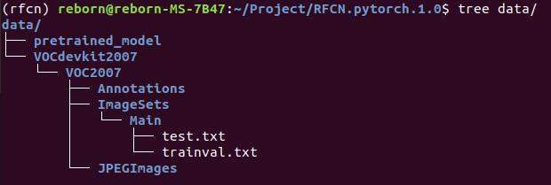

# A Pytorch.1.0 Implementation of R-FCN

## Introduction

This project is an pytorch implement R-FCN and CoupleNet, large part code is forked from [princewang1994/RFCN_CoupleNet.pytorch](https://github.com/princewang1994/RFCN_CoupleNet.pytorch). The R-FCN structure is refer to [Caffe R-FCN](https://github.com/daijifeng001/R-FCN) and [Py-R-FCN](https://github.com/YuwenXiong/py-R-FCN)

What I have done is updating the pytorch version from 0.3 to 1.0. (In theory, it should support pytorch.1.x version)


## Preparation


First of all, clone the code
```
$ git clone https://github.com/princewang1994/R-FCN.pytorch.git
```

Then, create a folder:
```
$ cd R-FCN.pytorch && mkdir data
$ cd data
```

### prerequisites

* Python 3.6
* Pytorch 1.0.0 (Maybe support higher than 1.0)
* CUDA 10.0 (I use this version)

### Data Preparation

* **PASCAL_VOC 07+12**: Please follow the instructions in [py-faster-rcnn](https://github.com/rbgirshick/py-faster-rcnn#beyond-the-demo-installation-for-training-and-testing-models) to prepare VOC datasets. Actually, you can refer to any others. After downloading the data, creat softlinks in the folder data/.
* **Pretrained ResNet**: download resnet50 from [here](https://pan.baidu.com/s/1mldNbItcy6T_qAl7sT6faA) (提取码: fba7) and put it to `$RFCN_ROOT/data/pretrained_model/resnet50_rcnn.pth`.

### Data Folder Presentation

```shell
$ tree data
```




### Compilation

Install all the python dependencies using pip:
```
$ pip install -r requirements.txt
```

Compile the cuda dependencies using following simple commands:

```
$ cd lib
$ python setup.py build develop
```

The nms, roi_pool, roi_align, psroi_pool and psroi_align come from below link. **Thanks for their open source work.**

- NMS, ROIPool, ROIAlign: [jwyangfaster-rcnn.pytorch](https://github.com/jwyang/faster-rcnn.pytorch)
- PSRoIPool, PSRoIAlign: [McDo/PSROIAlign-Multi-Batch-PyTorch](https://github.com/McDo/PSROIAlign-Multi-Batch-PyTorch)

## Train

To train a R-FCN model with ResNet101 on pascal_voc, simply run:
```
$ CUDA_VISIBLE_DEVICES=$GPU_ID python trainval_net.py \
				   --arch rfcn \
                   --dataset pascal_voc --net res101 \
                   --bs $BATCH_SIZE --nw $WORKER_NUMBER \
                   --lr $LEARNING_RATE --lr_decay_step $DECAY_STEP \
                   --cuda
```

- Set `--s` to identified differenct experiments. 
- Model are saved to `$RFCN_ROOT/models` 

## Test

If you want to evlauate the detection performance of a pre-trained model on pascal_voc test set, simply run
```
$ python test_net.py --dataset pascal_voc --arch rfcn \
				   --net res101 \
                   --checksession $SESSION \
                   --checkepoch $EPOCH \
                   --checkpoint $CHECKPOINT \
                   --cuda
```
- Specify the specific model session(`--s` in training phase), chechepoch and checkpoint, e.g., SESSION=1, EPOCH=10, CHECKPOINT=1036.

## Problem

1. train should add `--cuda`

2. If you have meet this problem below,

```shell
File "/home/reborn/Project/RFCN.pytorch.1.0/lib/roi_data_layer/roidb.py", line 9, in <module>
    from datasets.factory import get_imdb
  File "/home/reborn/Project/RFCN.pytorch.1.0/lib/datasets/factory.py", line 15, in <module>
    from datasets.coco import coco
  File "/home/reborn/Project/RFCN.pytorch.1.0/lib/datasets/coco.py", line 23, in <module>
    from pycocotools.coco import COCO
  File "/home/reborn/Project/RFCN.pytorch.1.0/lib/pycocotools/coco.py", line 60, in <module>
    from . import mask
  File "/home/reborn/Project/RFCN.pytorch.1.0/lib/pycocotools/mask.py", line 3, in <module>
    from . import _mask
ImportError: cannot import name '_mask'
```

you have two way to slove this problem.

- comment the coco dataset part, if you only use the voc datasets.

- install coco api, follow the below step:

  ```shell
  cd data
  git clone https://github.com/pdollar/coco.git 
  cd coco/PythonAPI
  make
  ```

## Acknowledgement

This project is established by [ReornL](https://github.com/RebornL). Thanks the faster-rcnn.pytorch.1.0's code provider [jwyang](https://github.com/jwyang)/**[faster-rcnn.pytorch](https://github.com/jwyang/faster-rcnn.pytorch)** , psroialign.pytorch's code provider [McDo](https://github.com/McDo)/**[PSROIAlign-Multi-Batch-PyTorch](https://github.com/McDo/PSROIAlign-Multi-Batch-PyTorch)** and the RFCN_CoupleNet.pytorch' s code provider [princewang1994](https://github.com/princewang1994)/**[RFCN_CoupleNet.pytorch](https://github.com/princewang1994/RFCN_CoupleNet.pytorch)**. Because of their excellent job,  I don't need to start my experiment from scratch.
